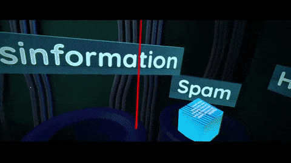

<link rel="stylesheet" href="../assets/css/mystyle.css">
<link rel="stylesheet" href="../assets/css/hoverimg.css">
<link rel="stylesheet" href="../assets/css/lightbox.css">

{:.project-title .cyber .liner-title}
# Murmur Nation

    

        <iframe width="854" height="480" class="pixel-div-enclose" src="https://www.youtube.com/embed/CfX7JOvyvUA" title="YouTube video player" frameborder="0" allow="accelerometer; autoplay; clipboard-write; encrypted-media; gyroscope; picture-in-picture" allowfullscreen></iframe>
    

 

{:.cyber .subtitle .liner}
## Get The Lowdown

    <h4 class="cyber info-subtitle">The Event</h4>
    <ul>
        <li><strong>Game Jam</strong>: Games for Change's <a href="https://itch.io/jam/xr-brain-jam/rate/1104487">XR Brain Jam 2021</a> (36 hours)</li>
    </ul>
    <h4 class="cyber info-subtitle">The Contributions of Ryan</h4>
    <ul>
        <li><strong>Roles</strong>: VR setup, shader creation, post processing</li>
        <li><strong>Tools</strong>: Unity3D</li>
    </ul>
    

    <h5 class="cyber info-subtitle">Interested in trying Murmur Nation?</h5>
    <ul>
        <li>Download from our <a href="https://itch.io/jam/xr-brain-jam/rate/1104487">Itch.io</a></li>
        <li>Please note: Murmur Nation is an Oculus Rift application</li>
    </ul>

    

        <a class="no-underline" href="https://www.youtube.com/watch?v=shToU-18rn0">
            <button class="btn">
            Presentation Video
            
            </button>
        </a>
    

    

        <a class="no-underline" href="https://xrbrain.itch.io/murmur-nation">
            <button class="btn">
            Itch.io
            
            </button>
        </a>
    

  

{:.cyber .subtitle .liner}
### Let Me Tell You More

    

        *Murmur Nation* is commentary on the current state of social media wrapped up in a an Oculus Quest 2 VR minigame.
    

  

{:.cyber .subtitle .liner}
### Made By Yours Truly

    

        

            
        

        <!-- 

            
        
 -->
        

            
        

    

 