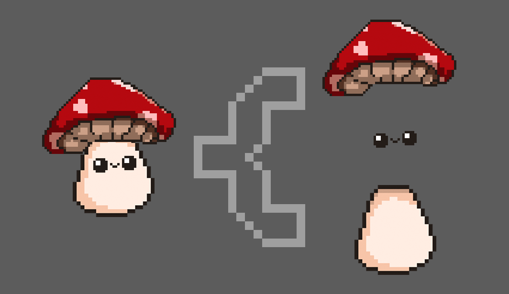
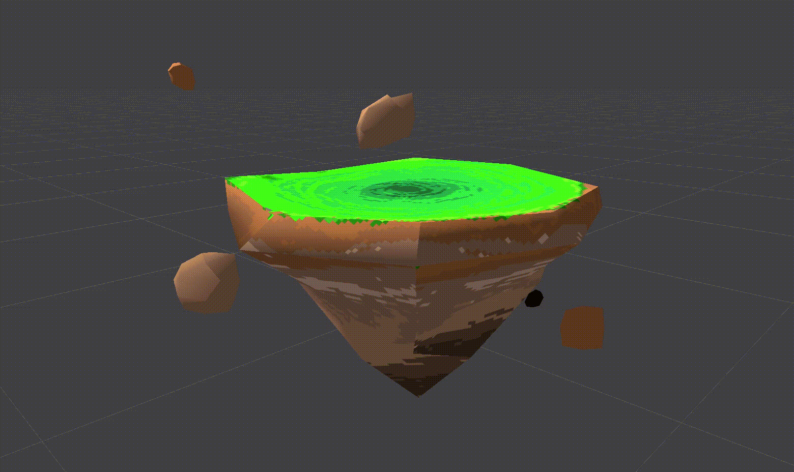

<link rel="stylesheet" href="../assets/css/mystyle.css">
<link rel="stylesheet" href="../assets/css/hoverimg.css">

# lARp [image title here]

## Info [image title here]
- **Hackathon**: University of Virginia's [HooHacks (2021)](https://hoohacks21.devpost.com/)
- **Awards**: Best Art & Gaming Hack - 1st Place

### Contribution [image title here]
- **Roles**: Development, Art
- **Tools**: Unity3D, Adobe Photoshop
- **Languages**: C#

 

    

        <a class="no-underline" href="https://www.youtube.com/watch?v=wR7rJfNN0Ow">
            <button class="btn">
            Demo
            
            r25
            </button>
        </a>
    

    

        <a class="no-underline" href="https://devpost.com/software/test-yotepg">
            <button class="btn">
            Devpost
            
            r25
            </button>
        </a>
    

### Project Description & Thoughts [image title here]
 
*lARp* is an augmented reality roleplaying game encouraging exercise via running. You play as a questing fungi looking to better the lives of your shroomy homeland by running errands for them. *lARp* tracks the time exercised and steps taken using a pedometer. Along the way, questers can run into friendly and deadly mushrooms. Using GPT-3, players can converse back and forth with unique characters before deciding their fate and defeating them in minigames between quests.

### Gallery [image title here]
 

    

        
        

            
        

        

            <a id="close-lightbox" class="long-animate" href="#!">Close Lightbox</a>
        

    

    

        
        

            
        

        

            <a id="close-lightbox" class="long-animate" href="#!">Close Lightbox</a>
        

    

    

        
        

            
        

        

            <a id="close-lightbox" class="long-animate" href="#!">Close Lightbox</a>
        

    

### Demo [image title here]
 

    

        <iframe width="854" height="480" src="https://www.youtube.com/embed/wR7rJfNN0Ow" title="YouTube video player" frameborder="0" allow="accelerometer; autoplay; clipboard-write; encrypted-media; gyroscope; picture-in-picture" allowfullscreen></iframe>
    

