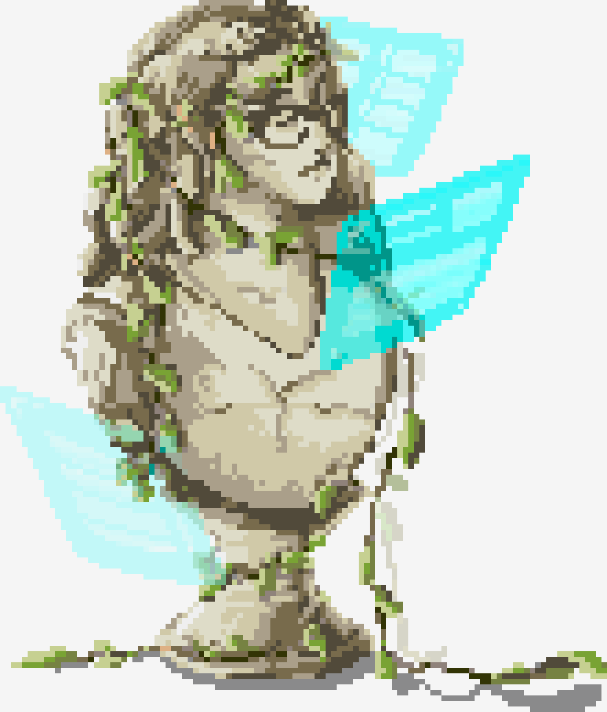

{:.subtitle .cyber}
# About Me // Contact Me

    

        
        <h5 class="cyber info-subtitle">Just a Little Bio</h5>
            Ryan Davis is an aspiring software engineer, VR developer, and digital artist. She earned her bachelor’s degrees in Art Practice from UC Berkeley (2015) and in Computer Science from Oregon State University (2022).
              
            She's worked different positions in the animation and mixed reality industries. Previous companies have included Industrial Light & Magic, Pixar Animation Studios, Microsoft, and Intel with projects revolving around 3D graphics, augmented reality tools, photogrammetry, and art education.
              
            Ryan is currently located in San Diego, CA and enjoys painting, participating in hackathons, gardening, 3D printing, and MMO gaming. She’s probably trying to complete a quest in Pokemon Go as you’re reading this.
        
    

    

        
    

 

    

        <h5 class="pixel-font info-subtitle">Features & Awards</h5>
    

    

        

            <ul class="none" id="feature-list">
                <!-- OSU Hackathons Feature -->
                <!-- <li>OSU EECS: <a href="https://eecs.oregonstate.edu/hacking-way-success">"Hacking the way to success"</a> (2021)</li> -->
                <!-- MLH Octocat -->
                <li>Winning GitHub Education's <a href="https://twitter.com/GitHubEducation/status/1358334185602179072">#MyOctocat Contest at QWER Hacks</a> (2021)</li>
                <!-- SIGGRAPH Interview -->
                <li>ACM SIGGRAPH <a href="https://www.siggraph.org/member-profile/ryan-davis">Spotlight</a> (2017)</li>
                <!-- Art Alumni -->
                <li>UC Berkeley Art Practice <a href="https://art.berkeley.edu/alumni">Alumni Gallery</a> (Ongoing)</li>
            </ul>
        

    

 

 

<!-- Resume/Contact -->

    <h5 class="cyber info-subtitle">Contact Me</h5>
    

        

            <button class="btn" onclick="location.href='../assets/img/common/RyanDavis_Resume.pdf'">Download Resume</button>
        

            

            <button class="btn" onclick="location.href='mailto:ryan.alex.davis@gmail.com';">Contact Me</button>
        

    

    

        

            Incase you don't want to open an email client: ryan.alex.davis@gmail.com :D
        

    

