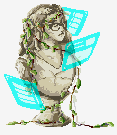

{:.subtitle .cyber .liner}
# Me, in the third person

    

        Ryan Davis is an aspiring software engineer, VR developer, and digital artist. She earned her first bachelor’s degree in Art Practice from UC Berkeley in 2015 and worked different positions in the animation industry. Previous companies have included Industrial Light & Magic, Pixar Animation Studios, and Microsoft with projects revolving around 3D graphics, photogrammetry, and art education.
          
        She is now attending Oregon State University’s post baccalaureate computer science program where she currently focuses on computer vision and mixed reality applications. Recently, she completed an internship at Intel designing for an augmented reality application.
          
        Ryan is currently located in San Diego, CA and enjoys painting, participating in hackathons, gardening, 3D printing, and MMO gaming. She’s probably trying to complete a quest in Pokemon Go as you’re reading this.
    

    

        
    

 

<!-- {:.subtitle .cyber .liner}
# Me, in the third person -->

    

        <!-- <h5 class="cyber info-subtitle">The Skillset</h5> -->
        <ul style="list-style:none">
            <li><h5 class="cyber info-subtitle">The Skillset</h5></li>
            <li style="list-style:square"><strong>Languages</strong>: Python, C, C++, C#</li>
            <li style="list-style:square"><strong>Tools/Software</strong>: Adobe Photoshop, Adobe Illustrator, Autodesk Maya</li>
            <li style="list-style:square"><strong>Toolkits</strong>: OpenVINO, ARKit, ARFoundation, MRTK</li>
        </ul>
    

    

        <ul style="list-style:none">
            <li><h5 class="cyber info-subtitle">Find Me Here</h5></li>
            <li>Languages: Python, C, C++, C#</li>
            <li>Tools/Software: Adobe Photoshop, Adobe Illustrator, Autodesk Maya</li>
            <li>Toolkits: OpenVINO, ARKit, ARFoundation, MRTK</li>
        </ul>
    

<!-- 
 -->

        <a class="no-underline" href="https://trisol.itch.io/catiators">
            <button class="btn">
            Download Resume
            
            </button>
        </a>

 