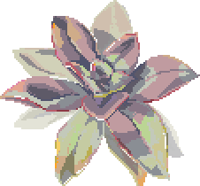

{:.subtitle .cyber .liner}
# So what am I up to now?

    <!-- Right Now -->
    

        
        
Last Updated: 08-10-2022

    

    

    

        <h5 class="cyber info-subtitle">Right This Moment</h5>
        <ul id="now-list">
            <li>The new grad job hunt</li>
            <li>Working on <em>Translucid</em> in Code Coven's Game Developer Program</li>
            <li>Portfolio and resume reviews</li>
        </ul>
         
        <!-- Forever -->
        <h5 class="cyber info-subtitle">Always</h5>
        <ul id="forever-list">
            <li>Pixel art practice</li>
            <li>Code and game dev practice</li>
        </ul>
    

